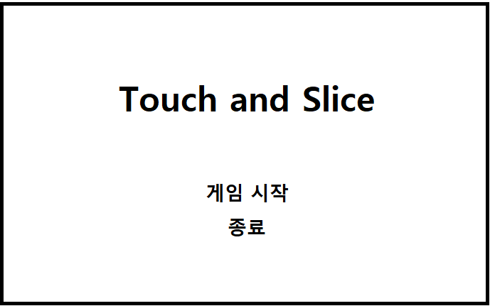

# Touch and Slice

## 게임 컨셉
```
Touch and Slice는 'Fruit Ninja'를 모작하는 게임입니다. 사용자는 화면을 터치하여, 지나가는 오브젝트를 자르면 점수를 얻습니다. 자르지 못하고 지나가는 오브젝트의 개수 혹은 잘라서는 안되는 오브젝트를 자른 횟수가 제한된 기회만큼 누적되면 게임은 종료되고 현재까지 획득한 점수를 보여줍니다.
```


## 필요한 핵심 기술
```
1. 사용자의 터치를 하나의 직선 혹은 곡선으로 판별하여 표현한다.
2. 오브젝트에 충돌한 시점의 순간 직선의 기울기를 오브젝트가 반으로 잘릴 때 적용되어 잘릴 수 있도록 한다.
3. 오브젝트의 이동이 단조롭지 않도록 포물선 이동을 적용한다.
```

## 개발 범위
```
Scene 전환 : 로비화면, 게임화면, 두 개의 Scene을 구성하여 전환할 수 있도록 한다.
UI : 현재 스코어, 최대 스코어, 시간, 결과화면, 메뉴화면에서 타이틀과 게임시작 메뉴.
게임 오브젝트: Canvas로 표현하는 간단한 직선/곡선, 이미지 오브젝트
게임 로직: 자른 횟수와 연속으로 자른 개수에 따른 점수 시스템, 실패 회수 누적하여 게임 종료를 판별하는 시스템.
수학: 직선과 직선의 기울기에 따라 다각형의 꼭짓점을 계산하여 분할.
```

## 게임 흐름
1. 메뉴 화면



2. 게임 화면


3. 결과 UI(게임 화면에 속함)
