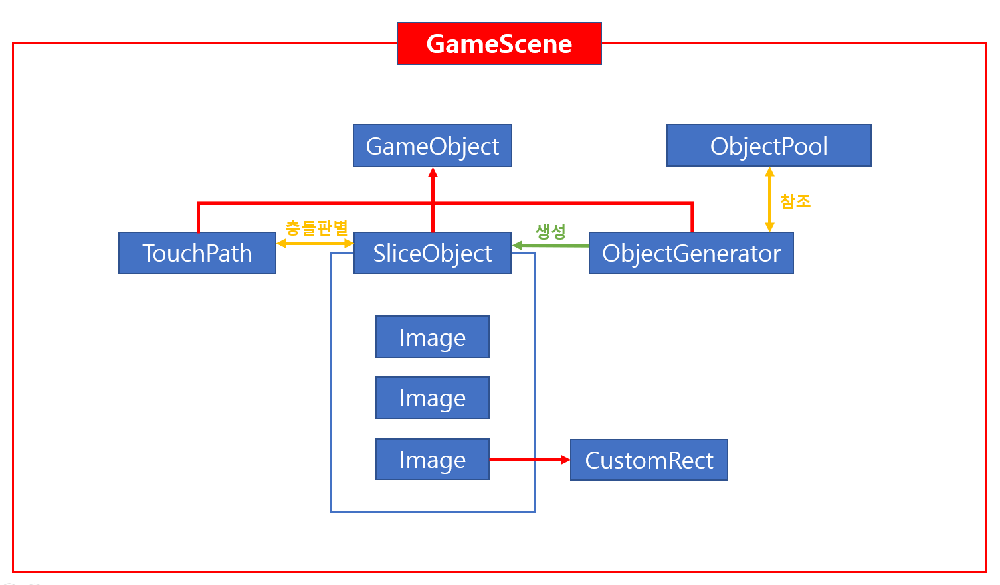
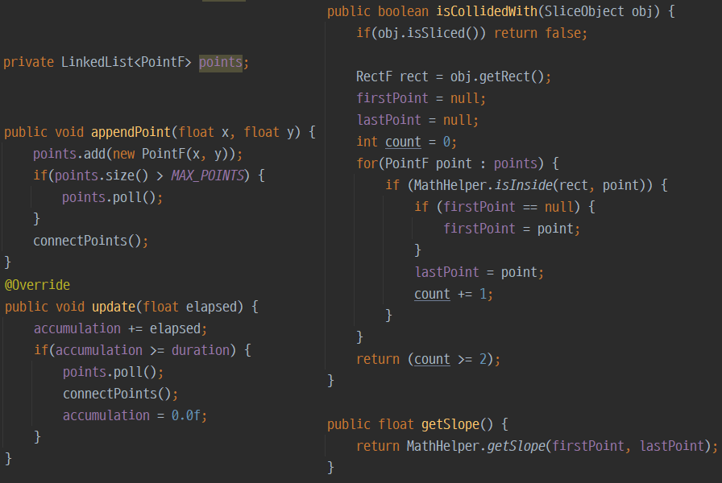
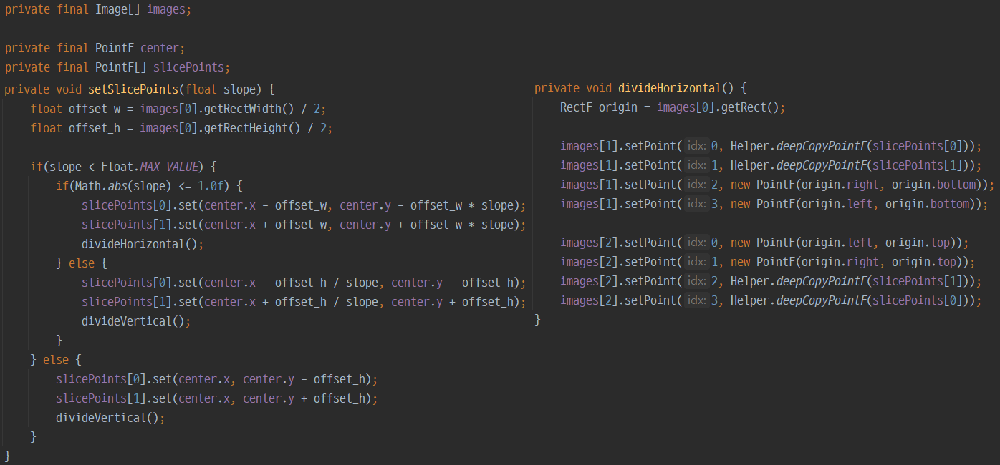
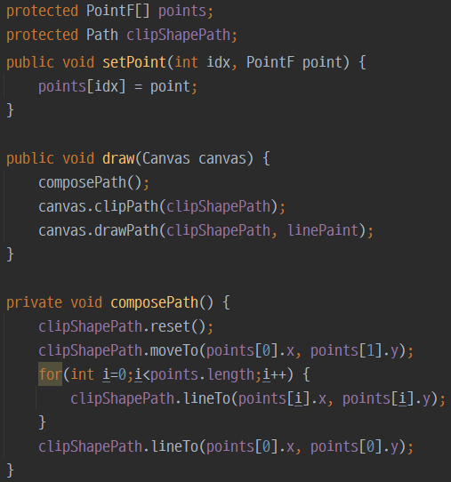
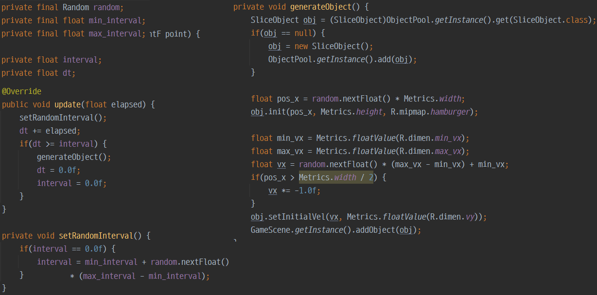

# Touch and Slice

## 게임 컨셉
```
Touch and Slice는 'Fruit Ninja'를 모작하는 게임입니다. 
사용자는 화면을 터치하여, 지나가는 오브젝트를 자르면 점수를 얻습니다. 
자르지 못하고 지나가는 오브젝트의 개수 혹은 잘라서는 안되는 오브젝트를 
자른 횟수가 제한된 기회만큼 누적되면 게임은 종료되고 현재까지 획득한 점수를 보여줍니다.
```


## 진행상황
#### 개발 요소별 진행률

```
1. 이미지 및 사운드: 이미지를 더 추가하고 사운드 효과가 필요한 부분에 사운드를 더 추가해야 한다.
2. 게임 로직: 함정 오브젝트를 생성하고, 이에 따라 게임 실패횟수, 점수 시스템을 도입한다.
3. 난이도 적용: 시간이 지남에 따라 랜덤성을 조절하여 난이도를 높여야 한다.
3. 결과 화면: 최고 기록과 현재 점수를 기록하는 결과 화면을 생성해야 한다.
```

#### 계획 대비 진행률

> 계획에 따라 순조롭게 진행되고 있다.

## 커밋로그
#### GitHub Commit Insight

> 수업과 관련된 커밋도 같이 있기 때문에 프로젝트 커밋과는 다를 수 있다.

#### 커밋 횟수

> 2주차와 4주차를 제외하고 10번 이상의 커밋을 하였다.

## 인 게임 핵심요소
#### 게임 오브젝트 다이어그램

```
- TouchPath, SliceObject, ObjectGenerator가 GameObject를 상속한다.
- ObjectGenerator는 ObjectPool을 확인하여 SliceObject를 생성한다.
- TouchPath는 SliceObject와의 충돌검사를 하여 기울기를 구하고 Object를 반으로 자른다.
```

#### TouchPath class

```
- 터치 입력마다 현재 위치에 해당하는 포인트 객체를 리스트에 넣는다.
- 리스트가 최대개수에 도달하면 가장 첫번재 포인트를 제거한다.
- 업데이트에서도 일정 시간이 지나면 첫번째 포인트를 제거한다.
- 오브젝트 내부에 포인트가 2개 이상 있으면 충돌처리한다.
```

#### SliceObject class

```
- 충돌했을 시 계산한 기울기에 따라서 교차지점 2개를 구한다.
- 교차된 2개의 지점으로 새로운 오브젝트 2개의 클립 사각형을 설정한다.
```

#### CustomRect class

```
- 설정된 포인트를 기준으로 클립 사각형을 구성한다.
- 캔버스에 클립 영역을 설정하여 다음에 이미지를 그릴 때, 해당 부분이 보이지 않도록 한다.
```

#### ObjectGenerator class

```
- 랜덤 객체를 이용하여, 랜덤 간격에 랜덤 위치에서 랜덤 속도로 객체를 생성한다.
- 객체는 오브젝트 풀에 존재하는지 확인해서 꺼낸다.
```

