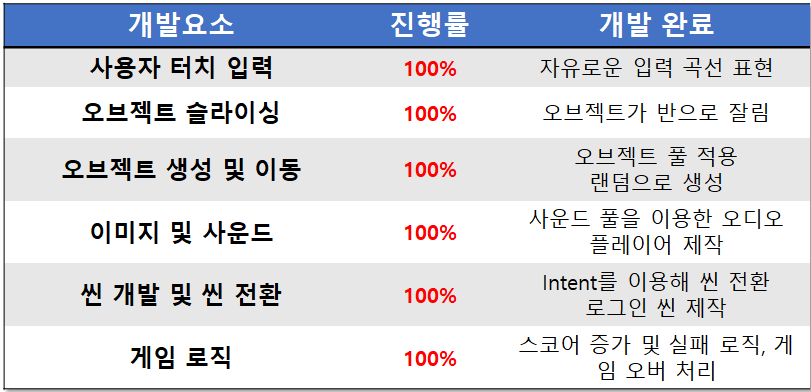
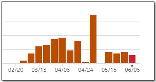
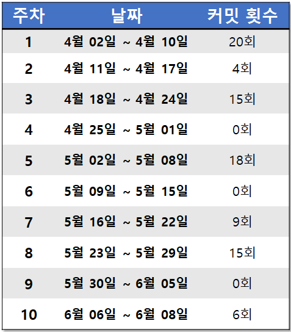
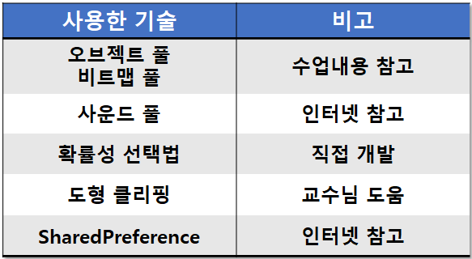
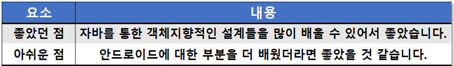

# Touch and Slice

## 게임 컨셉
```
Touch and Slice는 'Fruit Ninja'를 모작하는 게임입니다. 
사용자는 화면을 터치하여, 지나가는 정상적인 오브젝트(과일, 채소)를 자르면 점수를 얻습니다. 함정 오브젝트(패스트푸드)를 자르면 실패 횟수가 증가하고 실패 횟수가 3개가 되면 게임은 종료됩니다. 킬러 오브젝트(담배)를 자르면 실패 횟수에 상관없이 바로 게임이 종료됩니다. 게임이 종료되면 현재까지 얻은 최종점수를 보여줍니다.
```


## 진행상황
#### 개발 요소별 진행률


## 커밋로그
#### GitHub Commit Insight


#### 커밋 횟수


## 사용한 기술


## 수업에서 느낀점
